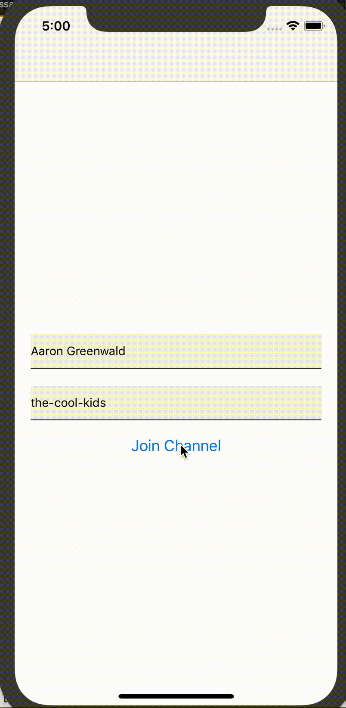

Hello there!
===

Welcome to the coding part of today's workshop! 
Your mission (should you choose to accept it) is to build a proof-of-concept
chat app that actually works. 
By the end of the day, we should all have an app we can use to chat with each other. 

_This README will not self-destruct at the end of this message, 
but the Firebase project I set up for us all to share will 
probably not be available forever. 
I have no intention of removing this repository, though, so you can always come back 
later to continue your React Native learning._ 

## 1 - Create the Project
We'll get started by creating the project using the quick start guide in 
the official React Native [docs](https://facebook.github.io/react-native/docs/getting-started.html).

tldr:

```bash

npm install -g create-react-native-app
create-react-native-app YetAnotherChatApp

#drink coffee

cd YetAnotherChatApp
npm start


```

Once we've all created the project, we'll take a tour of what just happened, how it works, and what we can do with it. 
Then we'll get started building our app!

## 2 - TextInput & Buttons - A Simple Screen

Don't worry about styling yet - let's just get some components on the screen
to get a feel for how this works. Let's aim for a screen that looks something like this:


## 3 - Navigation

Having just one screen in an app is kind of boring. 
Navigation is how we move users from one screen to another, 
and is a somewhat confusing topic in the React Native ecosystem. 
First let's pause to talk about the different options we have,
and then we'll go ahead and use the solution that is easiest to get started with. 

_Want to try something even better<sup>1</sup>? See the bonus round at the bottom of this document._

_<sup>1</sup> Yes, I know that's a subjective opinion. Deal with it. 🤪_

```bash
npm install --save react-navigation
```

Check out the [official docs](https://reactnavigation.org/docs/getting-started.html) of React Navigation to learn how to another screen, and navigate to it when the user taps the button. 
Pass the values of the text inputs to the new screen and render them there to make sure your navigation is wired correctly.



## 4 - A Chat Screen

Here's where things get serious. We'll want to connect to our datastore (Firebase), 
subscribe to a list of messages that notifies us whenever there's a new message, and render the messages in a list on the screen. We'll also need an input at the bottom of the screen
to allow users to send messages. First let's install some dependencies:

```bash
npm install --save firebase lodash
```

To save you time, I've created a quick-and-dirty service for handling the Firebase connections so you don't have to bother with learning the Firebase API if you're not familiar with it. You can just copy the code in [message-service.js](./message-service.js) into your app. 

_Note: if you ever actually have to work with Firebase to build a chat service, DO NOT EVEN THINK of using code that looks like this in production. It's buggy, has terrible performance, and a host of other problems. For a better example of a facade on top of firebase, check out the [code](https://github.com/wix-incubator/firebase-service) we actually use in production to handle hundreds of thousands of messages every day._

## 5 - Styling

How about we make it less ugly? 
You don't need to be a designer to be able to come up with something better than what we have.
Get creative, and try to follow best-practices by using `StyleSheet`s instead of inline styles.

## 6 - Animations

Animations in React Native are harder than they are on the web, but they're not impossible. First we'll pause to listen to some grumpy old guy (me) tell war stories about challenges he faced with proper animations in a chat screen (with demonstration), and then we'll take some time to try to animate our own app a bit. 

## 7 - Wrap-up

So...what do you think? A quick group discussion where we all get to share any insights, thoughts, perspectives, or questions we came up with throughout the day.

## Bonus Round

When I was in school, every class had _that_ kid who just _had_ to be smarter than everyone else. If you're that kid, this one's for you. If it's only 14:00 and you finished all the tasks the rest of us are struggling with, try this:

- Eject from Expo and use native components like React Native Navigation
- Performance work: how far can you push our messages list before it chokes on performance? And when it does, what do you need to do to fix the problem? _Hint: how often are components rendering? Are they rendering unnecessarily? Check out [https://github.com/maicki/why-did-you-update](https://github.com/maicki/why-did-you-update)._
 
